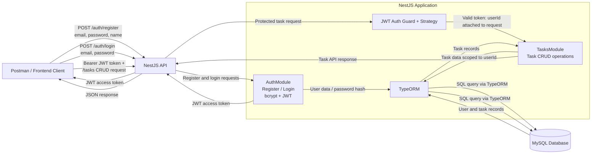

# TaskFlow Architecture

> Note: the current project is configured with SQLite (`database.sqlite`). This diagram uses MySQL as requested; changing to MySQL would require updating the TypeORM configuration and installing a MySQL driver.
