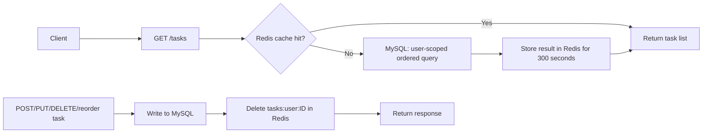

# API Performance Design

## Implemented optimizations

| Area | Change | API benefit |
| --- | --- | --- |
| Task-list reads | Redis cache-aside cache, five-minute TTL | Repeated `GET /tasks` requests avoid MySQL queries |
| Cache correctness | Invalidate `tasks:user:<userId>` after create, update, delete, and reorder | Clients do not receive an old task order or stale task fields after a write |
| Ordering queries | Composite MySQL index `IDX_task_user_sort_order` on `(userId, sortOrder)` | Supports the user-scoped ordered task-list query efficiently |
| Task creation | Selects only `sortOrder` while locating the user's last task | Reduces data read before appending a task |
| MySQL connections | Explicit pool limit and connection timeout configuration | Reuses connections and bounds unavailable-database waits |
| Redis failure mode | 500 ms default Redis connect/command timeout, no retry loop | A down cache does not hold API requests; MySQL remains the fallback |

The composite index is applied automatically in local development because TypeORM uses `synchronize: true`. Create and deploy an equivalent migration before enabling this change in a production database.

## Request paths



## Configuration

```env
DB_CONNECTION_LIMIT=10
DB_CONNECT_TIMEOUT_MS=10000
REDIS_URL=redis://localhost:6379
REDIS_CONNECT_TIMEOUT_MS=500
```

Tune `DB_CONNECTION_LIMIT` to remain below the MySQL server's connection capacity after accounting for every API instance. The defaults are suitable for local development, not a universal production recommendation.

## Verification

### Automated checks

```bash
npm test -- --runInBand src/tasks/tasks.service.spec.ts
npm run build
```

The task-service suite verifies cache hits, cache population on a miss, and invalidation after each mutation.

### Manual cache check

1. Start Redis and the API with `REDIS_URL` configured.
2. Log in and call `GET /tasks` twice with the same bearer token.
3. Run `redis-cli GET tasks:user:<userId>`; the serialized task list should be present.
4. Create, edit, delete, or reorder a task. The key should become `(nil)`.
5. Call `GET /tasks` again and confirm the key is restored with the new order/data.

### Database index check

Run this in MySQL after startup/migration:

```sql
SHOW INDEX FROM task WHERE Key_name = 'IDX_task_user_sort_order';
```

For a representative user task list, inspect the query plan:

```sql
EXPLAIN SELECT * FROM task WHERE userId = 42 ORDER BY sortOrder ASC, id ASC;
```

The selected index should be `IDX_task_user_sort_order` (or an equivalent user/order index). Measure actual latency and MySQL query counts under realistic load before changing TTLs or pool settings.

## Next steps when traffic grows

- Add paginated/task-filter endpoints if a user can own very large lists; full-list reorder intentionally requires all task IDs today.
- Use a database transaction for large reorder operations and consider a bulk `CASE` update when profiling shows `Repository.save()` is a bottleneck.
- Add HTTP load tests and metrics for p50/p95 latency, Redis hit rate, database pool saturation, and slow-query count.
- Use migrations rather than schema synchronization in production.
