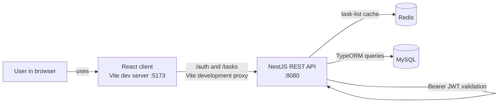
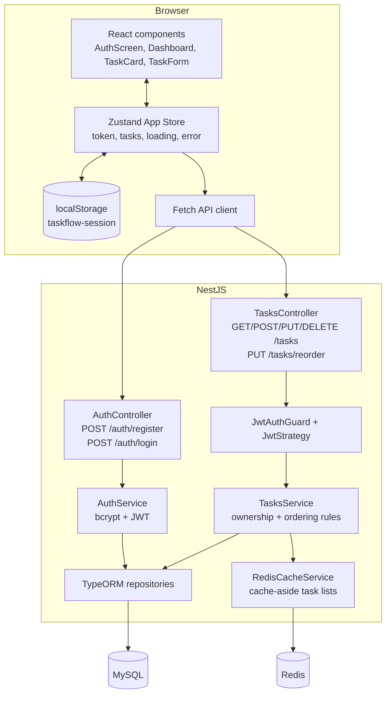
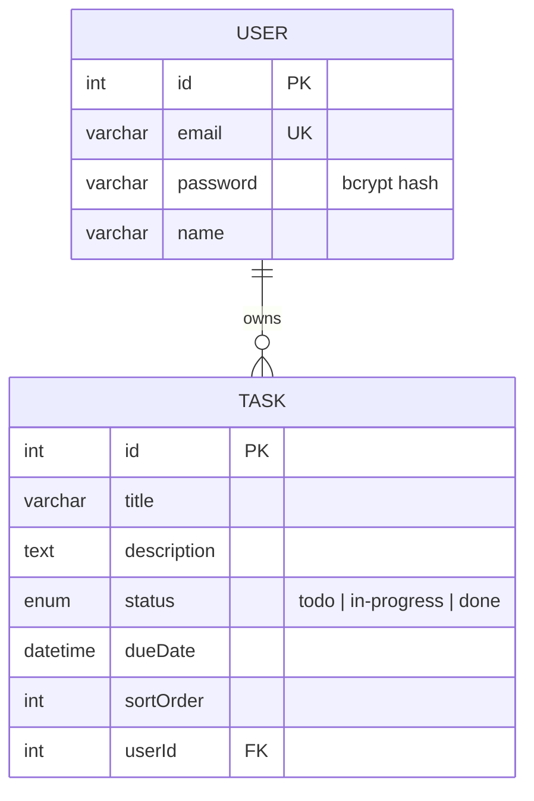
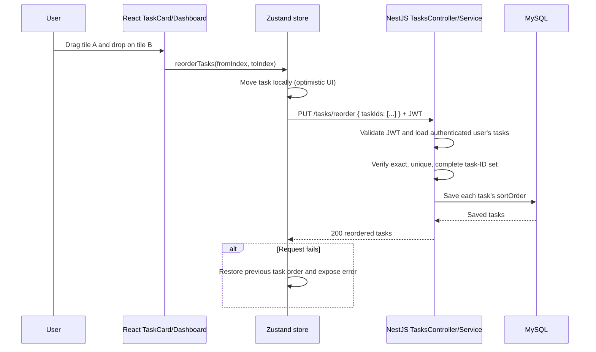
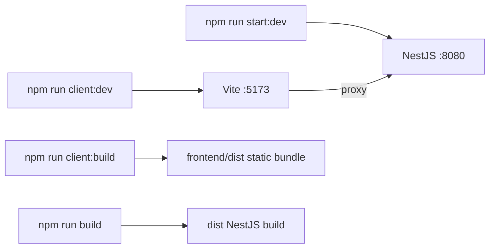

# TaskFlow System Design

## 1. Purpose and scope

TaskFlow is a single-user-view task-management application. A person can register, sign in, create and manage their own tasks, and change the saved task order by dragging a task tile. The frontend never decides authorization: every task request is authenticated and scoped by the NestJS backend to the JWT subject.

This document describes the system as it is implemented in this repository.

## 2. Technology summary

| Layer | Technology | Responsibility |
| --- | --- | --- |
| Web client | React 19, TypeScript, Vite | Renders authentication and task-management screens |
| Client state | Zustand with `persist` middleware | Holds tasks, loading/error state, and the locally persisted JWT |
| API | NestJS 11, Express adapter | REST endpoints, validation, authentication, ownership enforcement |
| Cache | Redis, ioredis | Five-minute per-user task-list cache; invalidated after task mutations |
| Persistence | TypeORM 0.3, MySQL (`mysql2`) | Maps `User` and `Task` entities to database tables |
| Authentication | Passport JWT, `@nestjs/jwt`, bcrypt | Password hashing, 1-hour signed access tokens, bearer-token validation |

## 3. System context

During local development, Vite proxies `/auth` and `/tasks` to `http://localhost:8080`. NestJS also enables CORS, so the frontend can be deployed separately when its API base URL/proxy is configured accordingly.

## 4. Component design

## 5. Data design

`Task.user` is required and has `onDelete: CASCADE`; deleting a user removes their tasks. A task list is retrieved with `sortOrder ASC, id ASC`, so `id` supplies stable ordering if older rows share the default order.

Redis holds only derived task-list JSON at `tasks:user:<userId>` with a five-minute TTL; it does not hold authoritative task data. `GET /tasks` follows the cache-aside pattern: read Redis, query MySQL on a miss, then populate Redis. Create, update, delete, and reorder each delete that user's cache key after MySQL succeeds.

## 6. Feature design

### Authentication and session

1. Registration sends `name`, `email`, and `password` to `POST /auth/register`.
2. The API rejects an existing email, bcrypt-hashes new passwords, and stores the user.
3. Login sends credentials to `POST /auth/login`; successful responses contain an access token signed for one hour.
4. Zustand persists only the token in browser `localStorage`. It fetches current tasks after login or an application reload.
5. Protected task requests include `Authorization: Bearer <token>`. `JwtStrategy` maps the token subject to `request.user.userId`.

### Task management

| User feature | Client action | API | Backend rule |
| --- | --- | --- | --- |
| List tasks | Loads dashboard | `GET /tasks` | Returns only the authenticated user's tasks in saved order |
| Create task | Submits TaskForm | `POST /tasks` | Appends task after the user's highest sort order |
| Edit task | Saves task tile form | `PUT /tasks/:id` | Only owner may update; non-owner is treated as not found |
| Delete task | Deletes tile | `DELETE /tasks/:id` | Only owner may delete |
| Reorder tasks | Drags a tile onto another tile | `PUT /tasks/reorder` | Full task-ID list must contain each owned task exactly once |

### Drag-and-drop reorder sequence

The client sends the entire desired order rather than a relative move. This makes the backend authoritative and prevents another user's task ID, a duplicate, or an omitted task from silently changing the list.

## 7. REST contract

| Method and route | Authentication | Request body | Success |
| --- | --- | --- | --- |
| `POST /auth/register` | No | `name`, `email`, `password` | `201` user without password |
| `POST /auth/login` | No | `email`, `password` | `200` access token |
| `GET /tasks` | JWT | — | `200` ordered task list |
| `POST /tasks` | JWT | title, description, optional status, dueDate | `201` task |
| `PUT /tasks/:id` | JWT | Any editable task fields | `200` task |
| `DELETE /tasks/:id` | JWT | — | `204` |
| `PUT /tasks/reorder` | JWT | `{ "taskIds": [3, 1, 2] }` | `200` reordered tasks |

Input validation uses Nest's whitelist validation pipe. For reordering, `taskIds` must be a non-empty, unique array of integers and must match the authenticated user's complete task set.

## 8. Local execution and build flow

The frontend build is separate from the NestJS build. `tsconfig.build.json` deliberately excludes `frontend/`, while `frontend/tsconfig.json` type-checks the React source before its Vite build.

Required environment variables:

| Variable | Purpose |
| --- | --- |
| `PORT` | NestJS listener port; the included local configuration uses `8080` |
| `DB_HOST`, `DB_PORT`, `DB_USERNAME`, `DB_PASSWORD`, `DB_NAME` | MySQL connection |
| `JWT_SECRET` | Signing and validation secret for access tokens |

## 9. Quality and operational notes

### Implemented safeguards

- Bcrypt password hashes are stored instead of raw passwords.
- JWT expiration is enforced by the Passport strategy.
- Task read/update/delete/reorder operations are always scoped to the authenticated user.
- Reorder requests are validated before any sort orders are saved.
- The client restores the prior visual ordering if the reorder request fails.
- Unit tests cover task creation, ownership-scoped update/delete, successful reorder, and invalid incomplete reorder.

### Recommended next improvements

- Use database migrations for production rather than `synchronize: true`.
- Make task creation and bulk reorder transactional to protect against simultaneous requests from multiple browser sessions.
- Add an index such as `(userId, sortOrder)` after confirming the generated TypeORM column name in the deployed schema.
- Serve the Vite production bundle through a CDN or configure Nest static hosting; the current repository supports separate local dev servers.
- Add API integration/end-to-end tests covering JWT-protected drag-and-drop persistence.
- Avoid storing long-lived bearer tokens in `localStorage` in a higher-security deployment; consider secure HTTP-only cookies with CSRF protection.
